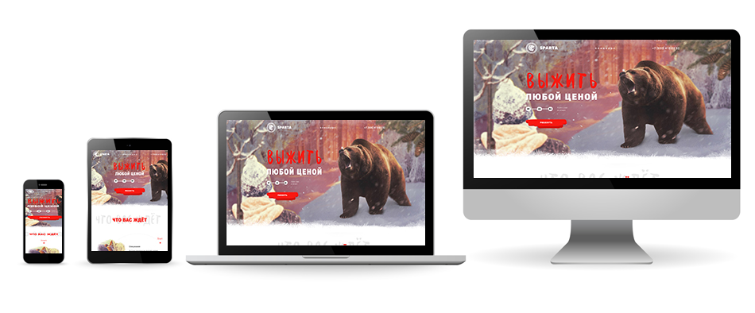
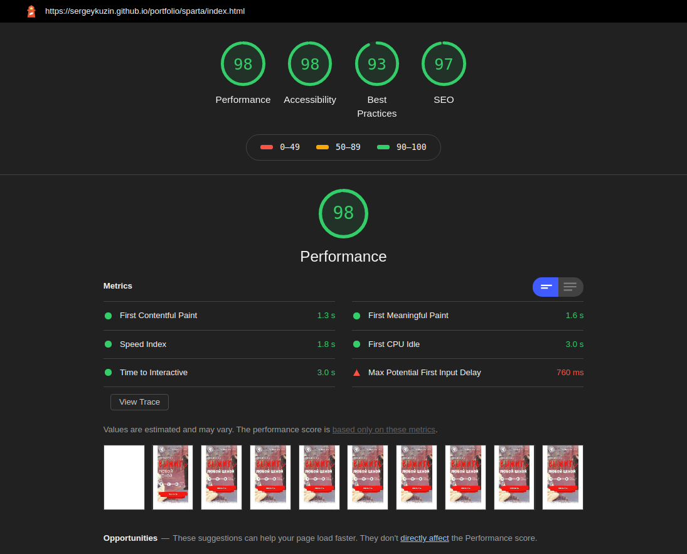
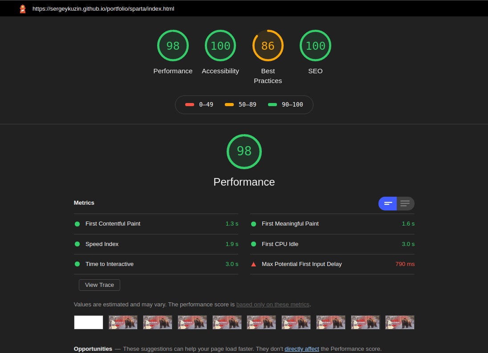

# Sparta
Landing page.

youtube API, webp + lazyload (IntersectionObserverAPI + polyfill for IE), swiper-slider.


<https://sergeykuzin.github.io/portfolio/sparta/index.html>

## Responsive


## Preview
[mobile version in png](./preview-mobile.png)

[tablet version in png](./preview-tablet.png)

[desktop version in png](./preview-desktop.png)


## Start local server
```sh
$ git clone git@github.com:sergeykuzin/sparta---portfolio.git
$ cd sparta---portfolio
$ npm install
$ gulp
```
## Tested
Browsers:
  - google chrome 83
  - interner explorer 11
  - microsoft edge 83
  - safari 10
  - firefox 77

Lighthouse 5.7.1 (google chrome 83.0.4103.106):

MOBILE DEVICE


DESKTOP DEVICE


